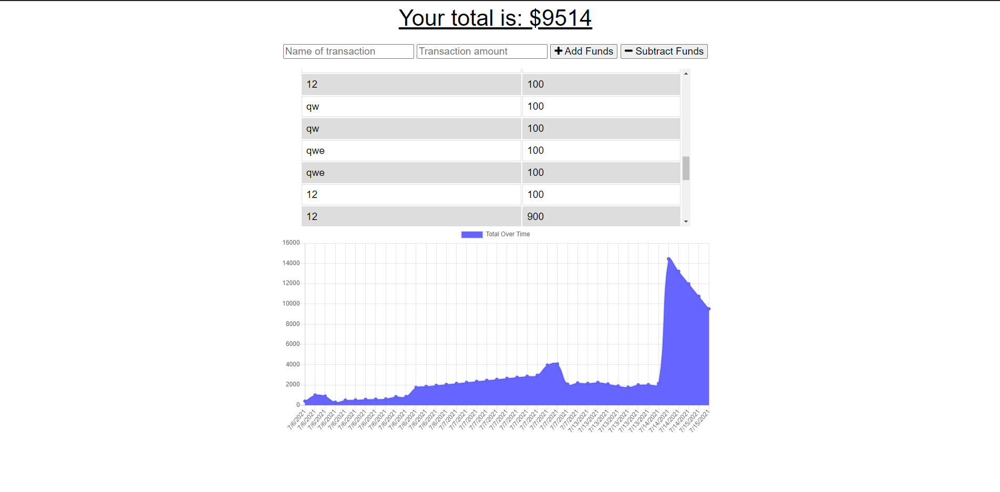

## Week 18 PWA's
Made by Abner Toribio Vazquez

## License

This project covered under a MIT License. 

## Table of contents 

[Description](#Description)

[Tests](#Tests)

[Usage](#Usage)

[Contributions](#Contributions)

[Licenses](#License) 

## Description

It is a budget tracker that allows the user to keep track of their transactions, and also has an offline feature that takes input while the user is offline and updates after the user has gone online again.

## Tests

THhe following instructions are how to run tests on this program: Type in 'node server.js' into the console if you want to do it off the webpage or alternatively you could follow this link: https://shrouded-dawn-63553.herokuapp.com/ . 

## Usage 

To help you keep track of your money and budget better.

## Contributions
Not taking contribution at the moment.

## Questions

If you have any questions or concerns, feel free to take a look at my Github: [AbnerTor](https//github.com/AbnerTor) or contact me by email at: abnertoribio@live.com

